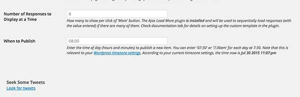

#The Daily Blank Wordpress Theme
by Alan Levine http://cogdog.info/ or http://cogdogblog.com/

## What is this?
A Wordpress Theme that provides a site that works like the [ds106 Daily Create](http://tdc.ds106.us) Unlike the TDC where responses needed to be posted to social media sites, for the Daily Blank participation is via sending a tweet to a dedicated account with a  a specific hash tag.

Look for a working versions at 
* [The Daily Blank (first prototype as a SPLOT)](http://splot.ca/dailyblank)
* [The You Show Daily](http://thedaily.trubox.ca/)
* [The Daily Stillness](http://daily.stillweb.org/)
* [UdG Agora Daily Try](http://udg.theagoraonline.net/daily)

You can also find some long-winded code laden blog posts on the development http://cogdogblog.com/tag/dailyblank/

## How to Install
I will make the big leap in that you have a self hosted Wordpress site and can install themes. The Daily Blank is a child theme based on [Wordpress Bootstrap](https://github.com/320press/wordpress-bootstrap) (sadly no longer maintained, but it works solidly) I provide the one in this repository  I have used on all sites listed.

**Very very crucial.** Do not just use the zip of this repo as a theme upload. It will not work. If you are uploading in the wordpress admin, you will need to make separate zips of the two themes and the one plugin inside the `wp-content folder` (*dailyblank* and *wp-bootstrap*, and upload each.) In addition, you must upload the Twitter Oauth For Developers plugin that comes in this repo; it has modifications critical  to make this site work (it looks for mentions rather than timelines, and has a custom function for clearing the cache).  

### Wobbly Documentation
These are also available internally under the Daily Blank Options menu. I say Wobbly because this is the first draft, and it feels like there are a lot of nitpicky steps I almost can do in my sleep. That does not help you.

Follow these steps, oh ye intrepid Daily ______ creator, and your site shall run like butter (no guarantee). 

In running the site, you will want to generate a pre-written list of Daily Blanks, they are saved as scheduled posts that are automatically published the same time every day. The twitter account is checked for replies to the account you are using and also must contain the hashtag associated with the Daily Blank.

Information for the matching tweets are saved locally as "Responses" (a custom post type) and identified with a custom taxonomy (hashtags).

#### Set Up a Twitter Account and Get the Keys
You will need a new or existing twitter account that acts as the recipient of tweeted responses. It can be an account you use for other purposes. With that account log in to [Twitter Apps](https://apps.twitter.com) to create a new one that will provide the necessary API keys. The access is okay with Read Only permissions.

Four of the keys are necessary to configure this site to be able to read the accounts mentions, two Application Keys and Two Access Tokens:

*	Consumer Key (API Key)
*	Consumer Secret (API Secret)
*	Access Token
*	Access Token Secret

#### Configure the Twitter Oauth Plugin
The Daily Blank uses Twitter Oauth For Developers plugin to access twitter and read mentions of your account; however you must use the modified version that comes with the Daily Blank theme, not the one from Wordpress.org. When the plugin is uploaded, look under Settings for `Twitter Feed Auth`.

Enter your own credentials in the four fields (in general the default cache expiry of 3600, 1 hour, is fine for most sites):

#### Useful General Setup Items
Time is important to the Daily, so make sure the `Time Zone settings`  match the reference time you want your site to be publishing new items in.

Now is also a good time to `create/customize the Default Category` (and optionally and other categories) you will want to use for your Daily Blank. The Default category will be applied to ever new Daily Blank, serving as a way to show a complete archive.

It's best to set your `Permalink` structure  (under `Settings`) to be Custom (the last option) and use for the setting field

    /%postname%/

#### Set Daily Blank Options
Access the Options at any time from the `Daily Blank Options` link from the top admin bar or also under the `Appearance` menu. Here comes the explanation for all settings!

*(The values in the fields come from the instance of this running as the [UdG Agora Daily Try site](http://udg.theagoraonline.net/daily)*

* **Name For What is Done Daily** (capitalized first letter) This should be the kind of daily activity, written as singular, and without "Daily" in front of it. The example shown is for the Daily Try, so each one is a "Try".
* **Twitter Account** This is the user name account you are using as a receiver of responses; enter it without the "@". The text below will provide an indicator if the Twitter Oauth plugin is installed and set up correctly.
* **Default Tweet** provides the basic language inserted for the twitter button. The tags will be added automatically, this is just the prompt for a default response.
* **Base Name for Tags** (lowercase) forms the unique hashtags tags applied to each item, in the example showsn the tags will be #agoratry1, #agoratry2, .... #agoratry11000, etc. A base tag is best if short but you may want to test of it is used elsewhere.
* **Category for All Daily Blanks** Set to the default category you edited above.
* **Start Tag Numbers at** in almost all cases this should be "1", but you might want to start your tags maybe a different number. Once the first Daily Blank is published, they will be increased sequentially.

Following this is a media selector used to create a background image shown in the front page- the most recently published Daily Blank will be displayed in a translucent box overlay.

Then two more settings...

* **Number of Responses to Display at a Time** For a new site, this can be ignored. If your Daily Blank site starts to get regularly more than 10 responses, you may want to consider installing the [Ajax Load More plugin](https://wordpress.org/plugins/ajax-load-more/) (see below for configuration details). This allows the number specified by the value of the field to be loaded, and subsequent sets are appended by ajax.
* **When to Publish** is the local time (relevant to your site's time zone setting) when items are posted. Enter a value for hour and minute. A new item will be published if they have been pre-written (the site saves them as scheduled posts).

Notice also the link for `Look for Tweets` -- the site is set up with its own timer to check twitter once an hour. This is driven by visits to the site; so use this link to force an instant check for new mentions to your account. This also clears the local cache.

#### Using the Ajax Load More Plugin
Install this plugin to create paginate loadings of twitter responses for busier sites (regularly receiving more than 10 responses). The only critical setting is to customize the `Repeater Template` so it embeds the tweets the same way the theme does:

Replace the default code with:

	

	<?php echo wp_oembed_get( get_post_meta( get_the_ID(), 'tweet_url', 1 ) );?>					
	

#### Creating New Daily Blanks</h2>
Write new items as normal posts (in the Dashboard they are referred to as "Daily Blanks"). Keep the title short enough to allow for the inserting of the incremental hashtag:

The box in the upper right should never need to be edited. It will let you know the next tag available that is used for your daily blank; in this case, "agoratry69" will be used internally as a tag, and the hashtag "#agoratry69" will be added to the title when saved.

Use the body of the post to add anything that might explain the item in more detail, including media.

Always *Save Draft* first. This does a number of things:

* The unique tag is added to the Daily Blank and inserted before the title as a twitter hashtag.
* Instructions are appended to the Daily Blank indicating the name of the twitter account to reply to and the hashtag
* The Daily Blank is scheduled to be published 24 hours after the most recently published or scheduled one-- the idea is to schedule these out days or weeks into the future so they are automatically published (check the first one published; a persistent bug is that the very first one on a site is somehow set to be January 1970! The schedule date can always be edited)

Scheduled or published Daily Blanks can be edited like any other Wordpress post, at any time. Review the queued ones via Submitted items end up as drafts on the site, which you can review via the `Daily Blanks` menu -&gt; `Scheduled Daily Blanks`

#### Daily Blank Public Submission Form
If you create a new Wordpress Page with a permalink of `add` it will be published as a form for your site visitors to suggest new Daily Blanks. Any text in the body of the page appears as a prompt.

Submitted items end up as drafts on the site, which you can review via the `Daily Blanks` menu -&gt; `Submitted Daily Blanks`. To activate one, simple edit it, save as draft, and it becomes the next one in line.

For long winded blog posts about its development, see http://cogdogblog.com/tag/dailyblank/

#### Random Daily Blank
Create a Wordpress page with a permalink of *random* (it needs no content); when opened, it rediects to a randomly chosen  published Daily Blank.

#### All Responses
Append `/response/` to your site's URL to see a display of all tweeted responses from the most recent listed first.

#### Leaderboard Shortcode
These codes can be used in posts or widgets to list the most active participants:

List all respondents in order of most active to least

	[dailyleaders]

List the top 10 respondents

	[dailyleaders number="10"]

List the top 10 respondents and exclude the ones identified in the hashtag taxonomy as ids 8 and 10

	[dailyleaders number="10" exclude="8,10"]

List all the twitter names that have contributed new Daily Blanks via the submission form 

	[dailyleaders type="contributors"]

#### Automatic Tweeting With dlvr.it
The site does NOT automatically tweet new Daily Blanks. Numerous plugins offer a capability to autotweet new posts; this is not built into the site.

One tool for doing this we have found is to set up a routing on  [dlvr.it](https://dlvr.it/) a free web service can be triggered to publish to a twitter account via an RSS feed from your site. Your mileage may/will vary. The examples below are for the [DS106 Daily Create](http://daily.ds106.us/)  which sends out its creative activities via [@ds106dc](https://twitter.com/ds106dc).

To use dlvr.it, first create an account on the site. You will create a *Route* which has a source (in this case an RSS Feed) and a *Destination* (in this case a twitter account).  [Go to the routes editor](https://app.dlvr.it/deliveries/routes) and click *+Add Route*. 

Under Sources on the left, click *+add*, then click the RSS icon (first on left), then the *Connect Feed* button. This opens the Source Feed Details tab. Enter the RSS feed for your site, which is the full URL of the site with <code>/feed</code> appended to it and give it a name.

On the next tab, *Feed Update* enter the following settings to make sure it does one per day.

And lastly, on the *Item text tab* you can insert any specific extra text to add to the tweets, e.g. hashtags for all tweets.

No other settings are required for the feed. Now on the right side, under destinations, click *+add*.  Click the twitter icon, and then authenticate with the account you want to be sending out the tweets.

Under the *Post Content* tab, we suggest tweeting the title and the link:

This is the only setting you should need to make. Your twitter account should automatically send out a tweet in an hour after your next scheduled Daily Blank is published.

#### Automatic Tweeting with IFTTT
We have seen some problems using dlvr.it on the DS106 Daily Create (I think we hit some capacity limit). 

As an alternative, you can [try a recipe we made in IFTTT](https://ifttt.com/recipes/413425-tweeting-daily-blank-challenges) where you can enter your site's RSS feed, any hashtags you want to use. You wiull have to use an IFTTT account authorized to post to the twitter account you want to be tweeting for you.

